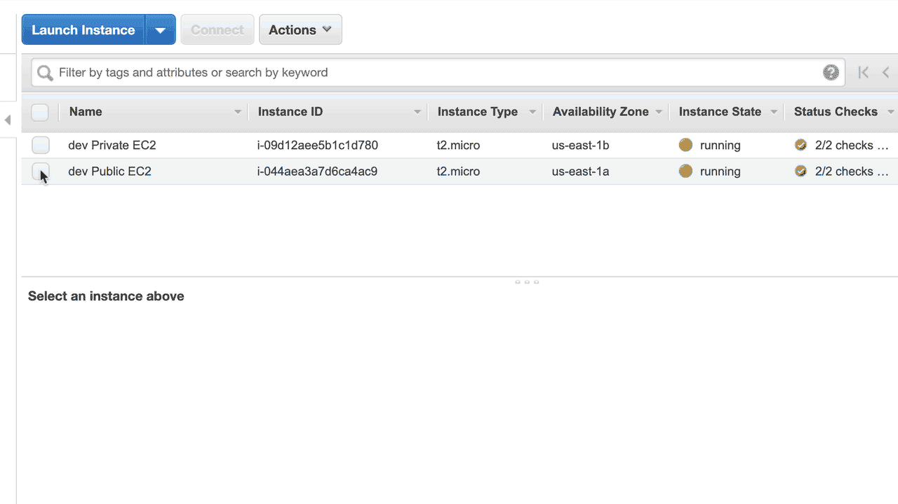

# AWS VPC Networking 101
This repo will walk you through setting up a fully functional and reasonably simple AWS VPC. I have tried to make it as complete as possible without making it overly complicated.

## Overview
In this example, we will create a VPC with two subnets. One subset will be private and one public. The scenario I'm trying to simulate is a network with internal (non-public), and external facing services. These services can range from micro-services to a backend datastore. To keep the example as simple as possible, we will be simulating the services using two Apache HTTP web servers.  For example, a request from the public internet is allowed over HTTP port 80 to the Apache server in the public subnet, and the public server is permitted to access the Apache server in the private subnet. However, public internet access is not allowed for inbound traffic to the private subnet.


## VPC Details

### VPC and Subnet Overview
When creating a VPC, one of the first things you will need to decide is the private IP address range. The private IP address range is specified using CIDR notation (Classless Inter-Domain Routing). For example, in this exercise, we will be using 10.0.0.0/16, which gives us 65,536 total addresses in our VPC with a range of 10.0.0.0-10.0.255.255. This VPC IP range will then be subdivided amongst each of the subnets.

Note - If you are unfamiliar with subnetting, I suggest you go through the [Subnetting Demystified](https://www.youtube.com/watch?v=cdNsiz12aCY) video series. 

The subnet will further divide the VPC address ranges to create smaller networks that can be individually managed. As mentioned previously, we will be creating two subnets within the VPC. Again we will need to use CIDR notation to specify the subnet ranges. These ranges must be withing the VPC 10.0.0.0/16 range. The first subnet will use 10.0.0.0/24, which gives us 256 addresses with a range of 10.0.0.0-10.0.0.255. The second subnet will use 10.0.1.0/24, which also gives us 256 addresses with a range of 10.0.1.0 - 10.0.1.255. The 256 addresses in each subnet are reduced by five due to AWS reserved addresses. The subnet address ranges cannot overlap within the VPC.  

We will be deploying the VPC using a set of CloudFormation templates that are provided in this repo.  


### Network Resources
AWS provides several layers to protect your network and its resources. In this simple VPC example, we will be using the following components listed here. These resources are also shown on the VPC Diagram below.

- Route Tables - A routing table contains a set of rules that direct network traffic from your subnet or gateway. This VPC example, uses two routing tables for the public and private subnets.
  - The public routing table allows traffic to flow to the public subnet from the AWS Internet Gateway, allowing internet traffic to flow to the HTTP Apache server on the EC2 instance.  
  - The private routing table allows resources in the private subnet to make outbound internet request through the AWS NAT Gateway. In this example we use this to install the HTTP Apache server onto the EC2.    
- Security Group - Security Groups act as firewalls for resources in a subnet where you can define inbound and outbound network traffic rules (e.g. HTTP over port 80). This VPC example uses two security groups for the public and private subnets.
  - The public security group allows inbound/outbound HTTP traffic over port 80 where the source is 0.0.0.0/0 (i.e. the internet). This example uses the AWS Session Manager to connect to the public EC2 instance so the security group also allows HTTPS traffic on port 443.
  - The private security group allows inbound HTTP traffic over port 80 but only from resources (EC2) within the public security group.   
- Network ACL - In this sample VPC the Network ACL are set to their default values. They can be used to provide an extra layer of security for controlling traffic in and out of your subnet.
- Internet Gateway - This sample uses Internet Gateway to allow inbound and outbound internet traffic to/from the public subnet, and outbound traffic from the private subnet(only through NAT gateway).
- NAT Gateway - This sample VPC is using the NAT Gateway to allow the EC2 instance in the private subnet to connect to the internet, but does not allow external internet resources to connect to the EC2 instance. 


### VPC Diagram


## Creating the VPC Network
To create the VPC used in the sample, you can create a CloudFormation stack using the provided simple_2_subnet_vpc.yaml template.

The following is an example of creating the CloudFormation stack using the AWS [cli tool](https://aws.amazon.com/cli/). The ```--profile <profile name>``` is optional and allows you to use a specific role when running the aws cli commands. See the [Using an IAM Role in the AWS CLI](https://docs.aws.amazon.com/cli/latest/userguide/cli-configure-role.html) documentation for more information.
```
$ aws cloudformation create-stack --stack-name simple-vpc --template-body file://simple_2_subnet_vpc.yaml --profile cloudformation
```

You may also create the stack using the CloudFormation services in the AWS Console. It's pretty easy to follow the Create Stack flow.

From the CloudFormation console select Create stack.


Then choose to upload a template and follow the wizard steps using the defaults.


## Creating the EC2 Instances
To create the EC2 instances used in the sample, you can create a stack using the provided simple_ec2_instances.yaml CloudFormation template.

**WARNING** - AWS charges will be incurred when running EC2 instances in your account. Please check the AWS pricing and be sure to remove the instances when complete.

The following is an example of creating the CloudFormation stack using the AWS cli tool. The CAPABILITY_IAM capability is required since this stack creates a IAM role. The ```--profile <profile name>``` is optional.
```
$ aws cloudformation create-stack --stack-name simple-ec2 --template-body file://simple_ec2_instances.yaml --capabilities CAPABILITY_IAM --profile cloudformation

```

You may also create the stack using the CloudFormation services in the AWS Console. The steps are the same as creating a stack for the VPC, with the exception of the stack name.

## Verifing the Public and Private Instances 

### Public Instance
To verify the public instance, you will point your Browser at the public DNS name given to the public EC2. The EC2 is running a simple Apache server with a index.hml containing the text "Public Instance" which will be sent back to your Browser.


### Private Instance
To verify the private instance, we will use the AWS Session Manager to ssh into the public EC2 instance which is granted access to the private EC2 through the Security Group. The private EC2 is running a simple Apache server with a index.hml containing the text "Private Instance" which will be sent back when you curl the private DNS of the EC2.


## Cleaning up the VPC Network
To clean up the VPC can EC2 instances, you will delete each of the CloudFormation Stacks in the opposite order of creation.

First delete the simple-ec2 stack.
```
$ aws cloudformation delete-stack --stack-name simple-ec2 --profile cloudformation
```

Once the simple-ec2 has been deleted you will delete the simple-vpc stack.
```
$ aws cloudformation delete-stack --stack-name simple-vpc --profile cloudformation
```


## Resources
https://docs.aws.amazon.com/vpc/latest/userguide/what-is-amazon-vpc.html
https://docs.aws.amazon.com/vpc/latest/userguide/VPC_Security.html
https://docs.aws.amazon.com/vpc/latest/userguide/vpc-network-acls.html
https://docs.aws.amazon.com/vpc/latest/userguide/vpc-nat-gateway.html
