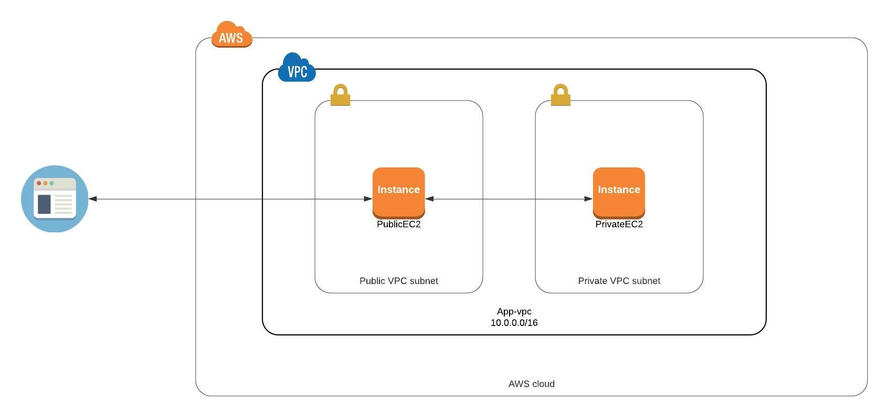
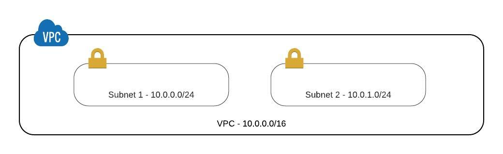
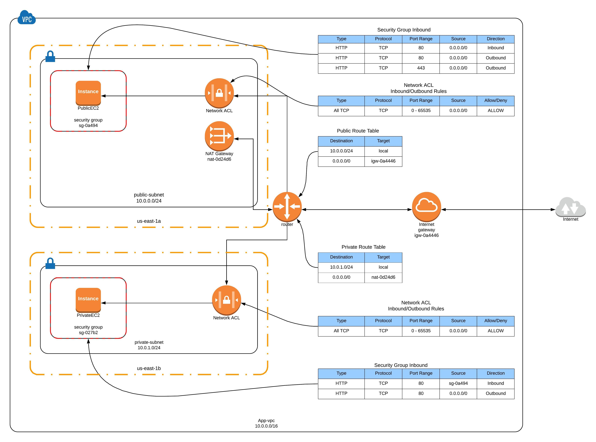

# AWS VPC Networking 101
This repo will walk you through setting up a fully functional and reasonably simple AWS VPC. I have tried to make it as complete as possible without making it overly complicated.

## Overview
In this example, we will create a VPC with two subnets. One subset will be private and one public. The scenario I'm trying to simulate is a network with internal (non-public), and external facing services. These services can range from micro-services to a backend datastore. To keep the example as simple as possible, we will be simulating the services using two Apache HTTP web servers.  For example, a request from the public internet is allowed over HTTP port 80 to the Apache server in the public subnet, and the public server is permitted to access the Apache server in the private subnet. 



## VPC Details

### VPC and Subnet Overview
When creating a VPC, one of the first things you will need to decide is the private IP address range. The private IP address range is specified using CIDR notation (Classless Inter-Domain Routing). For example, in this exercise, we will be using 10.0.0.0/16, which gives us 65,536 total addresses in our VPC with a range of 10.0.0.0-10.0.255.255. This VPC IP range will then be subdivided amongst each of the subnets.

Note - If you are unfamiliar with subnetting, I suggest you go through the [Subnetting Demystified](https://www.youtube.com/watch?v=cdNsiz12aCY) video series. 

The subnet will futher divide the VPC address ranges to create smaller networks that can be individually managed. As mentioned previously we will be creating two subnets within the VPC. Again we will need to use CIDR notation to specifiy the subnet ranges. These ranges must be withing the VPC 10.0.0.0/16 range. The fist subnet will use 10.0.0.0/24, which gives us 256 addresses with a range of 10.0.0.0-10.0.0.255. The second subnet will use 10.0.1.0/24, which also gives us 256 addresses with a range of 10.0.1.0 - 10.0.1.255. The 256 addresses in each subnet are reduced by five due to AWS reserved addresses. The subnet address ranges cannot overlap within the VPC. 

We will be deploying the VPC usign a set of CloudFormation templates that are provided in this repo.  


### Securing the Network and Resources
AWS provides several layers to protect your network and its resources. In this simple VPC example, we will be using the following components listed here. These resources are also shown on the VPC Diagram below.

- Route Tables - A routing table contains a set of rules that direct network traffic from your subnet or gateway. This VPC example uses two routing tables for the public and private subnets.
  - The public routing table allows traffic to flow to the public subnet from the AWS Internet Gateway. This will allow internet traffic to flow to the HTTP Apache server on the EC2 instance.  
  - The private routing table allows resources in the private subnet to make outbound internet request through the AWS NAT Gateway. In this example we use this to install the HTTP Apache server onto the EC2.    
- Security Group - Security Groups act as firewalls for resources in a subnet where you can define inbound and outbound network traffic rules (e.g. HTTP over port 80). This VPC example uses two security groups for the public and private subnets.
  - The public security group allows inbound/outbound HTTP traffic over port 80 where the source is 0.0.0.0/0 (i.e. the internet). This example uses the AWS Session Manager to connect to the public EC2 instance so the security group also allows HTTPS traffic on port 443.
  - The private security group allows inbound HTTP traffic over port 80 but only from resources (EC2) within the public security group.   
- Network ACL -
- Internet Gateway -
- NAT Gateway -


### VPC Diagram





## Creating the VPC Network


## Creating the EC2 Instances
To create the EC2 instances used in the sample you can run the provided simple_ec2_instances.yaml CloudFormation template.
**WARNING** - Creating AWS charges will be incurred when running EC2 instances in your account. Please check the AWS pricing and be sure to remove the instances when complete.

The following is an example for creating the cloudformation stack using the AWS cli tool. The CAPABILITY_IAM capability is required since this stack creates a IAM role.
```
$ aws cloudformation create-stack --stack-name simple-ec2 --template-body file://simple_ec2_instances.yaml --capabilities CAPABILITY_IAM --profile cloudformation

```

You may also create the stack usign the AWS Console


## Cleaning up the VPC Network


## Resources
https://docs.aws.amazon.com/vpc/latest/userguide/what-is-amazon-vpc.html
https://docs.aws.amazon.com/vpc/latest/userguide/vpc-network-acls.html
